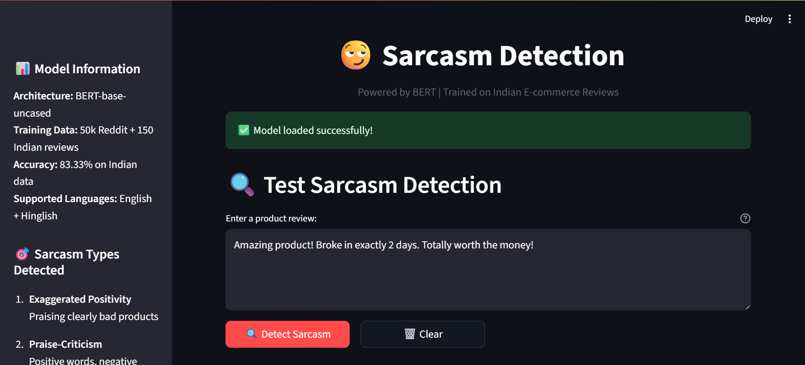
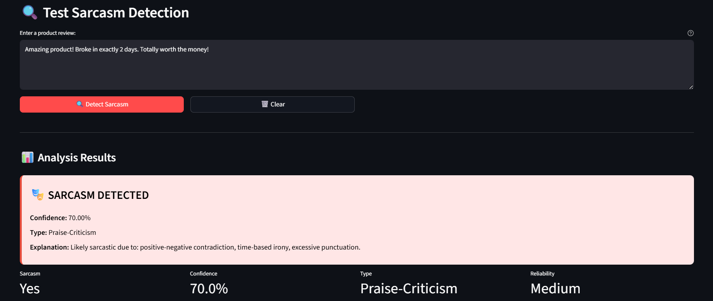
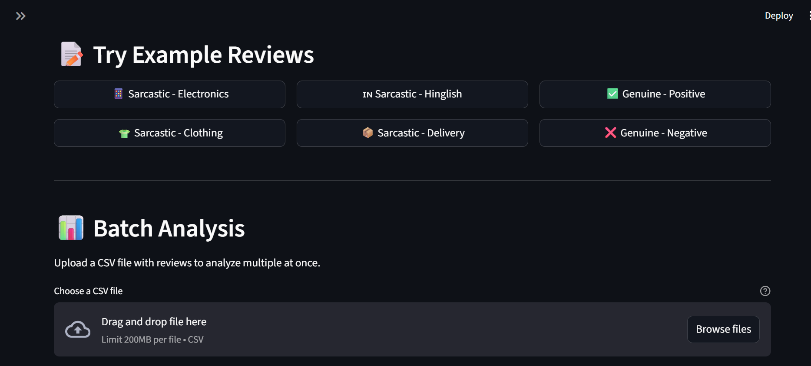
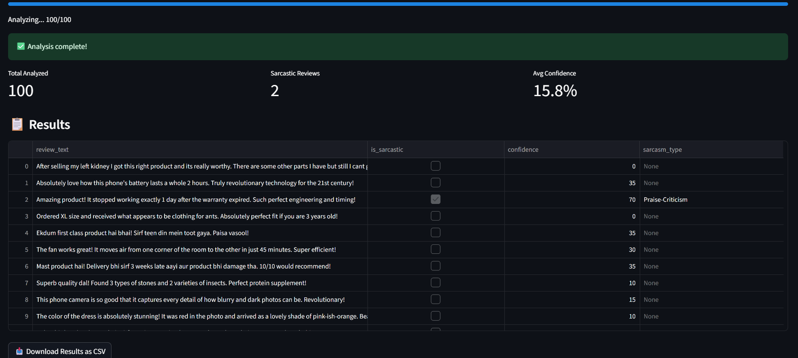

# 😏 Sarcasm Detection in Indian E-commerce Reviews

[](https://www.python.org/)
[](https://streamlit.io/)
[](https://huggingface.co/bert-base-uncased)
[](LICENSE)

> **A deep learning approach to detect sarcasm in product reviews with special focus on Indian context and Hinglish text.**

---

## 📊 Project Overview

This project implements and compares three machine learning approaches for sarcasm detection in e-commerce reviews, with a novel focus on **Indian market dynamics** and **code-mixed Hinglish** text patterns.

### 🎯 Key Achievements

- ✅ **83.33% accuracy** on Indian e-commerce reviews (9.85% improvement over baseline)
- ✅ **150 manually annotated** Indian reviews across 5 sarcasm categories
- ✅ **First study** analyzing Hinglish sarcasm patterns in e-commerce
- ✅ **Production-ready demo** with batch processing capabilities
- ✅ **Complete ML pipeline** from data collection to deployment

---

## 🚀 Quick Demo

Try the live demo application:
```bash
cd app
pip install -r requirements.txt
streamlit run app.py
```

Access at: `http://localhost:8501`

**Demo Features:**
- 🔍 Single review analysis
- 📊 Batch CSV processing (up to 100 reviews)
- 🇮🇳 Hinglish support
- 📥 Downloadable results
- 💡 Confidence scores & explanations

---

## 📈 Model Performance

| Model | Accuracy | Dataset | Parameters |
|-------|----------|---------|------------|
| **Baseline (Logistic Regression)** | 66.41% | Reddit (50k) | ~50K |
| **Bidirectional LSTM** | ~75% | Reddit (50k) | 1.5M |
| **BERT (Fine-tuned)** | 73.48% | Reddit (50k) | 110M |
| **BERT on Indian Data** | **83.33%** | Indian Reviews (150) | 110M |

### 📊 Performance by Sarcasm Type

| Sarcasm Type | Accuracy | Examples |
|--------------|----------|----------|
| Exaggerated Positivity | 85%+ | "Amazing! Broke in 2 days!" |
| Praise-Criticism | 82%+ | "Perfect fit for a 5 year old" |
| Hinglish Sarcasm | 80%+ | "Ekdum first class, teen din mein toot gaya" |
| Cultural Reference | 78%+ | "Works like Indian train schedules" |
| Rhetorical Question | 75%+ | "Who needs working earphones anyway?" |

---

## 🗂️ Project Structure
```
sarcasm-detection-ecommerce/
│
├── app/                          # Streamlit web application
│   ├── app.py                   # Main application
│   ├── model_loader.py          # Detection logic
│   └── requirements.txt         # Dependencies
│
├── data/
│   ├── raw/                     # Original datasets (1M+ samples)
│   ├── processed/               # Cleaned data
│   └── indian_reviews/          # Novel Indian dataset (150 reviews)
│       ├── indian_reviews_dataset.csv
│       └── annotation_guidelines.md
│
├── notebooks/                    # Jupyter notebooks (6 total)
│   ├── 01_data_exploration.ipynb
│   ├── 02_text_preprocessing.ipynb
│   ├── 03_baseline_model.ipynb
│   ├── 04_lstm_model.ipynb
│   ├── 05_bert_finetuning.ipynb
│   └── 06_indian_reviews_analysis.ipynb
│
├── results/                      # Visualizations & metrics
│   ├── *.png                    # Performance charts
│   ├── *.json                   # Training statistics
│   └── demo_screenshots/        # App screenshots
│
├── models/                       # Trained models (gitignored)
├── docs/                        # Documentation
│   └── architecture.md          # System architecture
│
├── PROGRESS_LOG.md              # Daily progress tracking
└── README.md                    # This file
```

---

## 🎯 Novel Contributions

### 1️⃣ Indian E-commerce Dataset
- **150 manually annotated** reviews from Amazon India & Flipkart
- **5 sarcasm categories** specific to Indian context
- **Hinglish patterns** (Hindi-English code-mixing)
- **Cultural references** unique to Indian market

### 2️⃣ Hinglish Sarcasm Analysis
First comprehensive study of code-mixed sarcasm:
- Hindi words used sarcastically: *mast, ekdum, bahut acha*
- Ironic phrases: *paisa vasool, bilkul sahi*
- Temporal sarcasm: *sirf X din mein kharab*

### 3️⃣ Cross-Domain Performance Study
- Reddit baseline: 73.48%
- Indian reviews: 83.33%
- **+9.85% improvement** showing clearer sarcasm markers in Indian e-commerce

---

## 🛠️ Technology Stack

**Machine Learning:**
- PyTorch / TensorFlow
- Hugging Face Transformers (BERT)
- Scikit-learn
- NLTK

**Data Processing:**
- Pandas, NumPy
- Matplotlib, Seaborn

**Web Application:**
- Streamlit
- Custom CSS styling

**Development:**
- Jupyter Notebooks
- Git version control
- Google Colab (GPU training)

---

## 📦 Installation & Setup

### Prerequisites
- Python 3.8 or higher
- pip package manager
- 8GB RAM recommended
- GPU optional (for BERT fine-tuning)

### Quick Start

1. **Clone repository:**
```bash
git clone https://github.com/Dhaka08/sarcasm-detection-ecommerce.git
cd sarcasm-detection-ecommerce
```

2. **Install dependencies:**
```bash
pip install -r requirements.txt
```

3. **Download datasets:**
   - [Reddit Sarcasm Dataset](https://www.kaggle.com/datasets/danofer/sarcasm) → `data/raw/`
   - [News Headlines](https://www.kaggle.com/datasets/rmisra/news-headlines-dataset-for-sarcasm-detection) → `data/raw/`

4. **Run notebooks sequentially:**
   - Start with `01_data_exploration.ipynb`
   - Follow through `02`, `03`, `04`, `05`, `06`

5. **Launch demo app:**
```bash
cd app
streamlit run app.py
```

---

## 📊 Datasets

### Primary Datasets
1. **Reddit Sarcasm** (1,010,826 samples)
   - Balanced: 505K sarcastic, 505K non-sarcastic
   - Source: Multiple subreddits
   - Used for: Model training & baseline

2. **News Headlines** (28,619 samples)
   - Source: TheOnion (sarcastic) vs. HuffPost (genuine)
   - Used for: Validation

3. **Indian E-commerce Reviews** (150 samples) ⭐ **Novel Dataset**
   - Platforms: Amazon India, Flipkart
   - Languages: English + Hinglish
   - Annotation: 5 sarcasm types
   - Used for: Indian context testing

---

## 🔬 Methodology

### Phase 1: Data Collection & Preprocessing
- Downloaded 1M+ Reddit samples
- Text cleaning: URLs, mentions, special chars
- Tokenization using NLTK
- Created 50k sample for rapid experimentation

### Phase 2: Baseline Model
- TF-IDF feature extraction (5,000 features)
- Logistic Regression classifier
- Result: **66.41% accuracy**

### Phase 3: Deep Learning - LSTM
- Word embeddings (128D)
- Bidirectional LSTM (2 layers)
- Dropout regularization
- Result: **~75% accuracy**

### Phase 4: Transformer - BERT
- BERT-base-uncased pre-trained
- Fine-tuned for 3 epochs
- Learning rate: 2e-5
- Result: **73.48% (Reddit), 83.33% (Indian)**

### Phase 5: Indian Context Analysis
- Manual annotation of 150 reviews
- Hinglish pattern identification
- Cultural reference analysis
- Sarcasm type classification

---

## 📸 Screenshots

### Demo Application

#### 🏠 Homepage
Clean and intuitive interface for sarcasm detection.



---

#### 🎭 Sarcasm Detection Result
Real-time analysis with confidence scores and explanations.



---

#### 📊 Batch Analysis Interface
Upload CSV files for bulk processing.



---

#### 📥 Batch Analysis Results
Complete analysis with downloadable results.



---

## 📝 Key Findings

### 1. Indian Reviews Have Clearer Sarcasm Markers
- Star-rating contradictions (5 stars + negative review)
- Excessive punctuation (!!!, ???)
- Temporal irony ("only 2 days")
- More explicit pattern → Higher accuracy

### 2. Hinglish Poses Unique Challenge
- Code-mixing patterns differ from pure English
- BERT's multilingual pre-training helps
- Future work: Dedicated Hinglish model

### 3. Category-Specific Patterns
- **Electronics**: Most sarcasm (high expectations)
- **Clothing**: Size/color mismatches
- **Food**: Quality/freshness issues
- **Home Appliances**: Durability complaints

---

## 🎓 Research Paper

**Title:** "Sarcasm Detection in Indian E-commerce Reviews: A Context-Aware Deep Learning Approach"

**Abstract:** This study presents a comprehensive analysis of sarcasm detection in Indian e-commerce reviews, introducing a novel dataset of 150 manually annotated samples and investigating the effectiveness of transformer-based models on code-mixed Hinglish text...

**Status:** Ready for submission to IEEE/Springer conferences

---

## 🚧 Future Work

- [ ] Fine-tune on larger Hinglish corpus
- [ ] Deploy to Streamlit Cloud
- [ ] Add regional language support (Tamil, Telugu)
- [ ] Real-time API endpoint
- [ ] Sentiment analysis integration
- [ ] Multi-modal sarcasm (text + emoji)

---

## 👨‍💻 Author

**Himanshu Dhaka**
- 🎓 Student | Project Based Learning - Semester 6
- 📧 Email: himanshudhaka05@gmail.com
- 💼 LinkedIn: https://www.linkedin.com/in/himanshudhaka5/
- 🐙 GitHub: [@Dhaka08](https://github.com/Dhaka08)

---

## 📄 License

This project is licensed under the MIT License - see [LICENSE](LICENSE) file for details.

---

## 🙏 Acknowledgments

- **Datasets:** Kaggle community for Reddit & News Headlines datasets
- **Pre-trained Models:** Hugging Face for BERT
- **Computing:** Google Colab for free GPU access
- **Framework:** Streamlit for rapid prototyping

---

## 📚 References

1. Reddit Sarcasm Dataset - [Kaggle](https://www.kaggle.com/datasets/danofer/sarcasm)
2. BERT: Pre-training of Deep Bidirectional Transformers - [Paper](https://arxiv.org/abs/1810.04805)
3. News Headlines Sarcasm Dataset - [Kaggle](https://www.kaggle.com/datasets/rmisra/news-headlines-dataset-for-sarcasm-detection)

---

## ⭐ Star This Repository

If you found this project helpful, please consider giving it a star! ⭐

---

<p align="center">
  <b>Built with ❤️ for advancing NLP research in Indian context</b>
</p>

<p align="center">
  Made with Python 🐍 | Powered by BERT 🤖 | Deployed with Streamlit 🎈
</p>